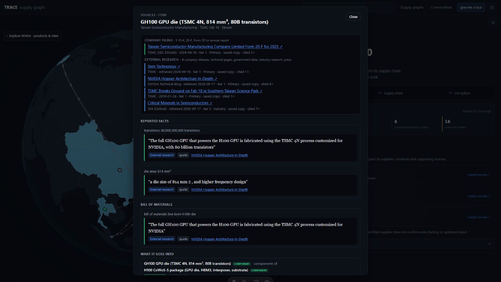
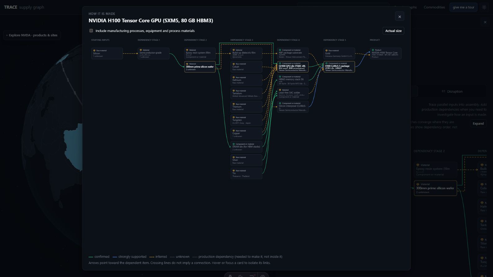
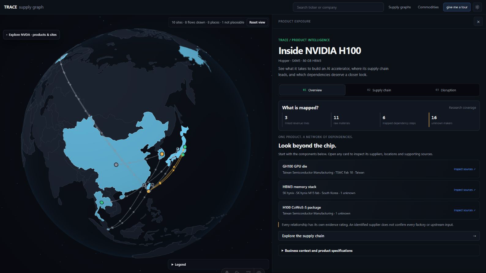
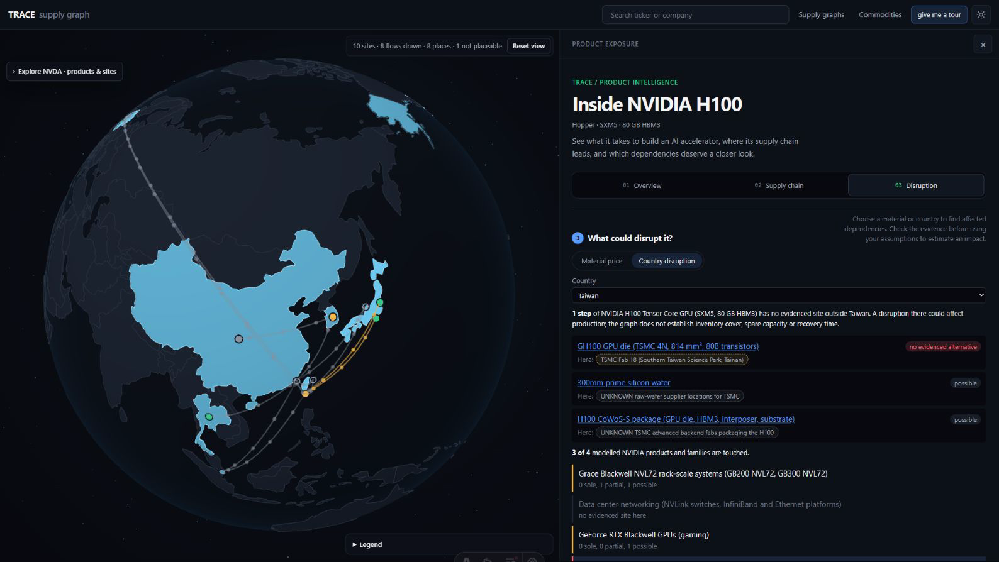
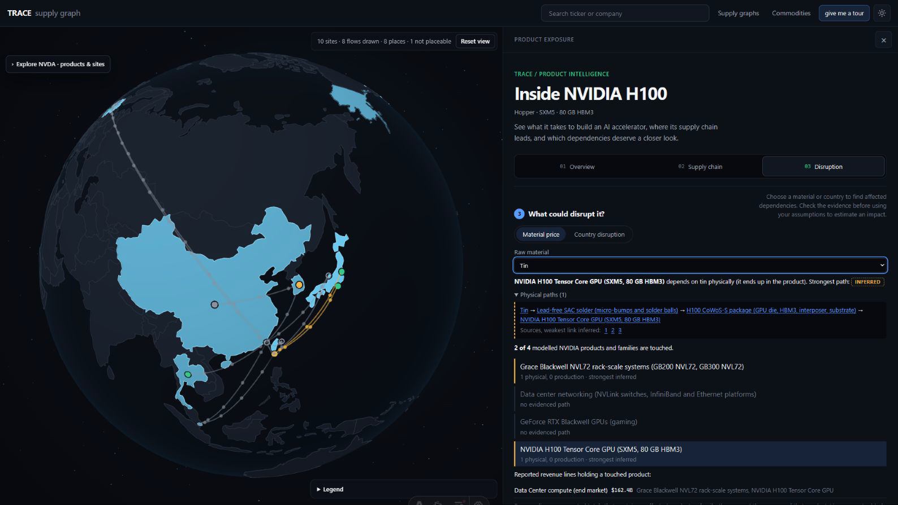

## Overview

TRACE builds a company's supply chain as a graph that runs from reported revenue down to raw materials, and draws it on a 3D globe. Each relationship in the graph, such as "TSMC fabricates this die at Fab 21" or "this battery pack uses CATL cells", carries its own sources, dates and confidence. When the evidence runs out, the graph says **UNKNOWN**. It does not guess a likely supplier.

`revenue line → product → component → supplier → facility → processing → raw material`

## The problem

A company's filings tell you what it sells and, sometimes, who it buys from. They rarely tell you what its products are physically made of, where each part is made, or which raw materials the whole chain depends on. The information that does exist is scattered across 10-Ks, conflict minerals reports, supplier filings, government data and technical sources. Most supply chain maps fill the gaps with plausible guesses and present them with the same confidence as the facts.

## Approach

Every supply graph is a hand-researched dataset that has to pass validation before it can be loaded. The rules are strict:

- **Confidence is set per edge and never inherited.** An edge is CONFIRMED only when a tier 1–3 source (a filing, a government source or a technical source) states that exact relationship. STRONGLY_SUPPORTED needs two independent sources or one technical source. INFERRED and UNKNOWN both require written reasoning.
- **Paths report their weakest link.** A confirmed HBM supplier does not make the whole path into the rack confirmed.
- **Quotes are checked word for word** against the cached filing or captured web page they claim to come from.
- **Everything is dated.** Edges can expire, announced plants are marked ANNOUNCED rather than treated as current production, and evidence older than 548 days is flagged as stale.
- **No invented numbers.** Revenue comes only from reported lines. Any money estimate comes from assumptions the viewer enters, and is labelled as theirs.

Physical flow (wafer → die → package) is kept apart from production dependencies (EUV scanners, CMP slurry), so the graph shows both what ends up in the product and what the chain can't run without.

*Every claim opens its evidence. The GH100 die's facts are quoted word for word from the sources behind them, each with its tier and date.*

## Data

- **NVIDIA:** FY2026 10-K revenue lines, Grace Blackwell NVL72 racks and networking, down through TSMC, HBM, advanced packaging, EUV tools and Form SD smelters.
- **NVIDIA H100:** one GPU traced from raw materials to the finished product, with seven documented corrections to the starting bill of materials.
- **Tesla:** Model Y and Megapack/Powerwall, including four cell sources, cathode and lithium refining, rear-motor magnets and the giga-cast underbody.

Tesla's graph was built with no code changes, which shows the model works outside semiconductors.

*The H100 traced from raw materials to the finished GPU. Line style shows confidence: solid green is confirmed, dashed amber is inferred.*

Two pipelines run alongside the graph. **Filing extraction** uses Claude Haiku 4.5 to pull named suppliers and purchased inputs from annual reports, and a claim counts only if its quote is found in the filing. **Commodity research** searches the web for commodities the chain uses beyond what the filings say, and every finding must carry a citation that names the commodity.

## System / architecture

### How data flows through TRACE

From a filing or a web page to a line on the globe. Every stage keeps the evidence attached: a quote is checked word for word against the saved source before a graph loads, and each relationship carries its own confidence all the way to the screen.

*Select the diagram to open it full size.*

| Colour | Means the same as in the app |
| --- | --- |
| Green border | Primary, confirmed evidence: filings and the sources dialog |
| Blue | TRACE's own research and the workspace views |
| Cyan | Stored data: the source cache and the database |
| Amber | A gate that can refuse a dataset, or anything built on your own input |
| Dashed amber | Your assumptions: the workbook and the estimate panel |
| Dashed grey | The filing and commodity pipelines that run beside the graph |

### Stack

- **Web:** Astro, TypeScript and React, with a Three.js globe behind an imperative API.
- **API:** FastAPI on Python 3.12, SQLAlchemy and Alembic, covering the graph, traversal, impact analysis and reports.
- **Data:** PostgreSQL 16 with PostGIS, plus a gazetteer built from Natural Earth and curated places.
- **Models:** Claude Haiku 4.5, used only for extraction and research. The supply graph itself uses no model at runtime.
- **Runtime:** Docker Compose.

LLM calls go through a gateway that caches and replays responses, so the test suite never reaches the network.

## Using it

Search for a ticker (NVDA, TSLA) to open its supply graph on the globe. Discs mark facilities, smelters and campuses. Arcs carry material from the sites making an input to the sites making the next item downstream. Each flow is coloured by its weakest edge: green for confirmed, blue for strongly supported, amber for inferred and grey for unknown. Every relationship opens its evidence, including quotes, source tiers, dates and reasoning.

Choosing a product such as the NVIDIA H100 or Tesla Model Y narrows the globe to that product's chain and opens a flow chart from raw materials through processing, suppliers and components to the finished product.

*Choosing the H100 narrows the globe to that product's sites and flows, and opens its product panel.*

**What would it touch?** Pick a raw-material price rise or a country disruption to see the affected steps, which of them have no evidenced alternative site, and which products and revenue lines are exposed.

*A Taiwan disruption: the GH100 die has no evidenced site outside Taiwan, and three of four modelled NVIDIA product families are touched.*

*A tin price rise: the path runs through solder into the package, and its weakest link is inferred, so the result is labelled inferred.*
